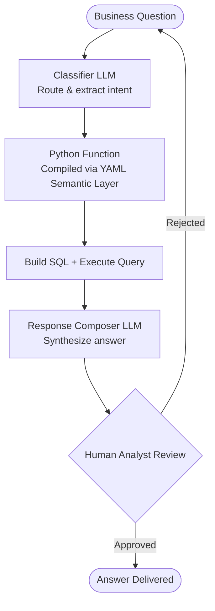
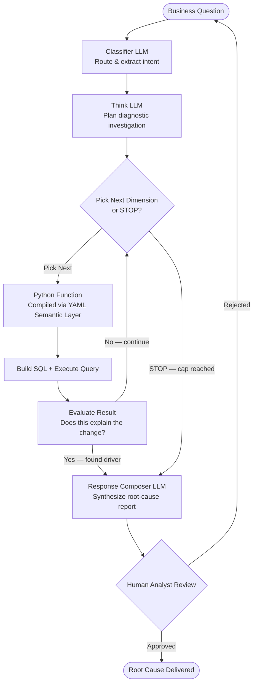
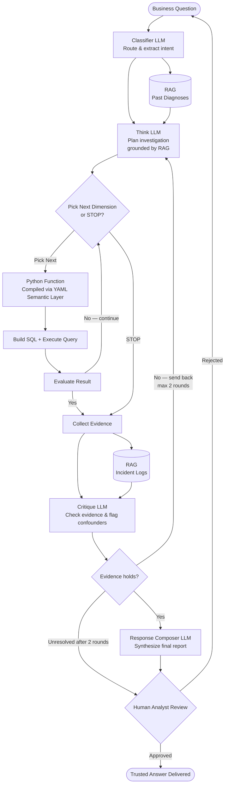

# QuickBrief — Architecture Flowcharts

Mermaid diagrams for all three iterations. Render in GitHub, Notion, or any Mermaid-compatible viewer.

---

## Iteration 1 — Workflow Agent (What Happened?)

Fixed, deterministic pipeline. 2 LLM calls, same cost every time.

**Key properties:**
- Deterministic by design — same question, same number
- Read-only data access with RBAC
- Semantic layer grounds every query
- Guard against large SQL result sets

---

## Iteration 2 — ReAct-Style Bounded Agent (Why Did It Happen?)

Adds root-cause diagnosis. Autonomous bounded loop capped at ≤5 tests.

**Key properties:**
- Bounded loop — hard cap of 5 diagnostic queries (code-enforced, not model-directed)
- Stop decision uses a deterministic threshold check, not an LLM call
- Async/batching option for 50% cost reduction at higher latency
- Builds on Iteration 1's validated SQL foundation

---

## Iteration 3 — Multi-Agent + RAG (Trust the Recommendation?)

Adds critique gate and RAG grounding. Bounded at ≤2 critique rounds.

**Key properties:**
- Critique LLM catches confounders data-only systems miss
- RAG inherits source-document permissions (RBAC-safe)
- Critique bounded at ≤2 rounds; shares the same 5-test investigation budget
- Unresolved disagreement always escalates to human — never loops indefinitely
